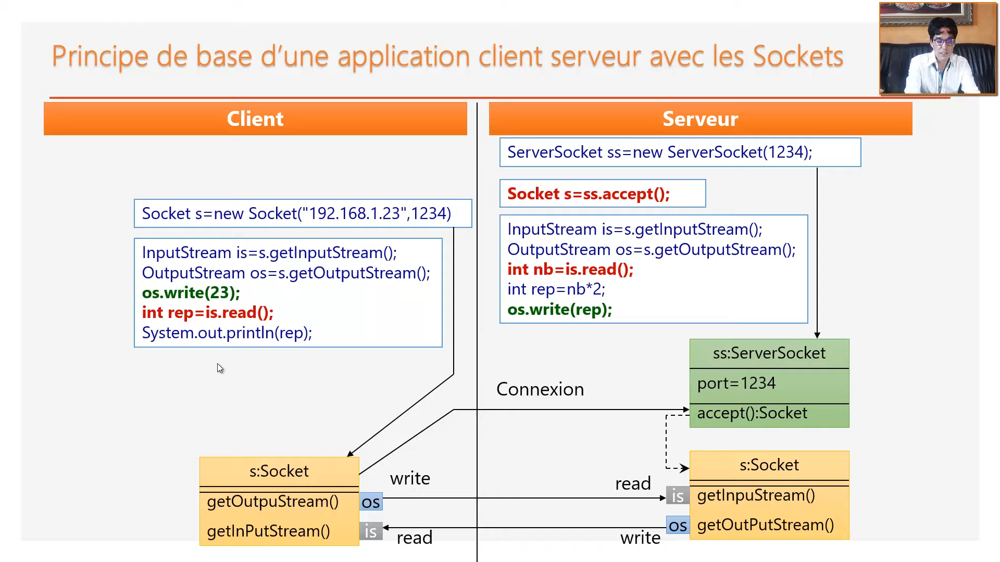

# **1. Pricipe de base d'une application client serveur avec les sockets**  
---  
---
---
# Coté serveur  
---

### **1. Création des objets ServerSockets** :  

> ServerSocket ss = new ServerSocket(Port);  

    ServerSocket est un objet qui attend le cleint demender une connextion  
### **2. La méthode accept() de l'objet ServerSocket** :  

> Socket s =  ss.accept();  

    Une fois que le client demende une connection la méthode accept s'éxécute , et elle retourne un objet de type Socket qui contient des informations sur le client   
L'objet Socket que la méthode accept retourne contient 2 méthodes :  

1. __getInputStream()__ 
> **InputSteam is = s.getInputStream()**  

    La méthode getInputStream retourne un objet de type InputStream , cet objet avec lequel nous pouvons lire les données envoyées par le client .
> **int nb = is.read()**  
>  **int rep = nb*2;** 

    ici le client envoie au serveur un nombre qu'on a stocker dans une variable nb , et puis on le multipler par 2 .  

    La méthode read() attend que le client m'envoie un octet 
2. __getOutPutStream()__
> **getOutputStream os = s.getOutputStream()**  
La méthode getOutputStream retourne un objet de type OutputStream , cet objet avec lequel nous pouvons écrie des données pour envoyées par le client .  

> **os.write(rep)**  

    Envoyé la réponse au client
---  
---
---
# Coté client  
---
> Socket s = new Socket("192.168.10.2",port)  

    ici on a crée une socket , et comporte comme paramétres 2 arguments : 
    1. L'adresse ip de serveur .
    2. Le port de serveur .

    une fois qu'on a crée l'objet Socket , automatiquement ce dernier envoie une demende de connection au serveur (Le protocoele tcp qui va faire ça) , puis la méthode accept() au serveur s'éxécute .

    L'objet Socket va aussi générer duex méthode :  
1. __getInputStream()__ 
> **InputSteam is = s.getInputStream()** 

    Les objets envoyée par le client avec la méthode getInputStream() vont être reçue par le serveur avec la méthode getOutputStream()
    

2. __getOutPutStream()__
> **getOutputStream os = s.getOutputStream()**  

    Les objets reçue par le client avec la méthode getOutputStream() vont être envoyée par le serveur avec la méthode getInputStream()
> **os.write(23)**  

    ici le client envoie au serveur le nombre 23  
    
    

---  
---  
---  

# Recevoir et envoyer des chaînes de charactères :  
### Création de l'objet ServerSocket  
----  
`SeverSocket ss = new ServerSocket();` 
### Attendre une connexion d'un client   
`Socket s = ss.Accept();` 
### Pour lire une chaîne de charactère envoyée par le client  
`InputStream is = s.getInputStream();`  
`InputStreamReader isr = new InputStreamReader(is);`
`BufferReader br = new BufferReader(isr);`

  
 ### Pour envoyée une chaîne de characère à un client  
 `OutputStream os = s.getOutPutStream();`  
 `printWriter pw = new printWriter(os,true);`  
    
    L'objet printWriter prend deux paramétres , le duexiéme paramétre , est un booléan , si le paramétre est égale à true , alors le steam va envoyée la chîne de charactère au client , mais si false , le stream va stocker la chaîne de charactère dans un buffer , (le stream stocke les chînes de charactères par println()), et pour les envoyer , le stream utilise la méthode flush() . 
 `pw.println("chaîne de charactère que je voudrais envoyer")`  
 .png)
 
 ---  
 ---  
 ---  
 # R/E des objets (Sérialisation et désérialisation)  

    Pour envoyer un objet dans un stream , il doit que sa classe implémente l'interface Serializable
## Exemple : 
---
`public class Voiture implement Serializable {`  
`String mat;int carburant;`
`public Voiture(int m, String c){this.mat=m;this.carburant=c;} }`
## Pour séarialiser un objet (envoyer un objet vers le client) :  
`Socket s = new Socket(ipAddress,port);`  
`OutputStream os = s.getOutputStream();`  
`ObjectOutputStream oos = new ObjectOutputStream(os);`  
`Voiture V1 = new Voiture(50,"M215");`  
`oss.writeObject(V1);`   

    La méthode writeObject() transforme l'objet en un tableau d'octet et l'envoie 
## Pou désérialiser un objet (recevoir un objet depuis un server) :  
`ServerSocket ss = new ServerSocket(port);`   
`Socket s = ss.accept();`  
`inputStream is = s.getinputStream();`   
`objectinputStream ois = new objectinputStream(is);`  
`Voiture v = (Voiture) ois.readObject();`

    La méthode readObject() transforme le tableau d'octets envoyé par la méthode writeObject() en un objet de type Voiture  
---  
---  
---  
# Serveur multi-Threads avec IO Bloquantes :   

    Pour qu'un serveur puisse communiquer avec plusieurs clients en même temps , il fault que : 
    1. Le serveur puisee attendre une connexion à tout moment .
    2. Pour chaque connexion , il fault créer un nouveau thread associé à la socket du client connecté , puis attendre à nouveau une connexion .
    3. Le thread crée doit s'occuper des opérations d'entées-sorties(read/write) pour communiquer avec le client indépendamment des autres activitées de serveur .  

    

